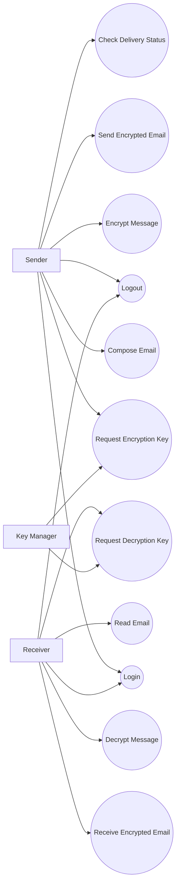

# SCRUM-12 — Use Case Diagram (Sender, Receiver, KM)

## Objective

Create and document the Use Case Diagram for the Quantum Secure Email Client, identifying Sender, Receiver, and Key
Manager (KM) as the main actors and documenting their interactions with the system.

## Actors

### 1. Sender

The Sender composes and sends an email.

Main interactions:

- Login
- Compose email
- Request encryption key
- Encrypt message
- Send encrypted email
- Check delivery status
- Logout

### 2. Receiver

The Receiver receives the encrypted email and decrypts it using the required cryptographic key.

Main interactions:

- Login
- Receive encrypted email
- Request decryption key
- Decrypt message
- Read email
- Logout

### 3. Key Manager (KM)

The Key Manager manages and provides the required cryptographic key material to authorized participants.

Main interactions:

- Receive key request from Sender
- Provide encryption key
- Receive key request from Receiver
- Provide corresponding key material

## Use Cases



## Main Message Flow

```text
Sender
  |
  | Compose Email
  v
Request Encryption Key
  |
  v
Key Manager (KM)
  |
  | Key Material
  v
Sender
  |
  | Encrypt Message
  v
Send Encrypted Email
  |
  v
Receiver
  |
  | Request Decryption Key
  v
Key Manager (KM)
  |
  | Corresponding Key Material
  v
Receiver
  |
  | Decrypt Message
  v
Read Email
